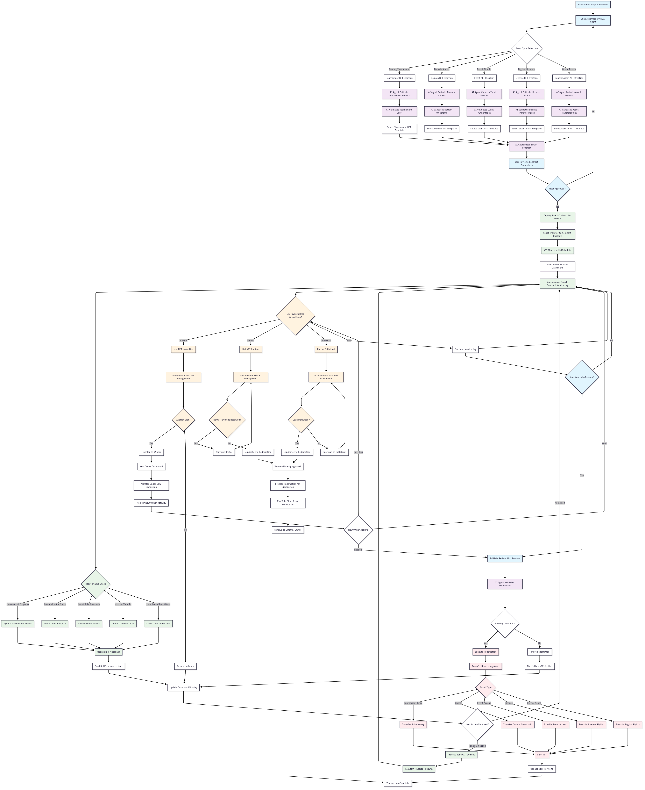

# 🚀 Adaptic Protocol - AI-Powered Redeemable NFTs on Massa

**[Live Demo](https://adaptic.dev.massa-deweb.xyz/)**


## 🌟 What is Adaptic Protocol?

Adaptic Protocol revolutionizes digital asset ownership by creating **AI-powered autonomous custody for redeemable NFTs** on the Massa blockchain. Unlike traditional static NFTs, our platform transforms digital ownership into dynamic, self-managing assets that adapt to real-world conditions through autonomous smart contracts and AI agents.

### 🎯 Core Innovation

**Transform static ownership into intelligent, autonomous assets that:**
- 🤖 **Self-manage** through AI-powered autonomous contracts
- 🔄 **Auto-update** based on real-world events and conditions  
- 💰 **Generate liquidity** through DeFi integrations
- 🎮 **Bridge digital assets** with real-world utility

---

## 🏗️ Project Architecture & Flow



Our architecture demonstrates the complete lifecycle of redeemable NFTs:

1. **🤖 AI Conversation**: Users describe their asset requirements in natural language
2. **🧠 Agent Processing**: LangGraph agents analyze requirements and select appropriate templates
3. **📋 Contract Deployment**: Autonomous smart contracts are deployed on Massa blockchain
4. **🔄 Autonomous Management**: Contracts self-execute based on real-world conditions
5. **💰 DeFi Integration**: Assets become liquid through lending, auctions, and trading
6. **🎯 Redemption**: Final value extraction through automatic redemption mechanisms

---

## 🏗️ What We Built

### 🎨 Interactive Chat Interface
A conversational AI platform where users can describe their asset requirements in natural language and automatically deploy customized smart contracts. The interface features:

- **🤖 Intelligent AI Assistant**: Powered by LangGraph and LangChain frameworks
- **💬 Natural Language Processing**: Describe assets in plain English
- **⚡ Real-time Contract Deployment**: Instant smart contract creation
- **📱 Responsive Design**: Works seamlessly on all devices
- **🔗 Massa Wallet Integration**: Secure wallet connection with Massa Station

### 🌐 Decentralized Architecture
- **🏗️ Massa Autonomous Smart Contracts**: Self-executing contracts without external dependencies
- **🌐 DeWeb Hosting**: Completely decentralized frontend hosting
- **🔗 Cross-contract Communication**: Seamless interaction between different asset types
- **⏰ Time-based Operations**: Automated expiry and renewal mechanisms

---

## 🎮 Redeemable NFT Examples

### 🏆 Gaming & Esports
```
🎮 Tournament Entry + Betting NFTs
└── Automatic bracket progression updates
└── Real-time prize pool tracking
└── Automated winner payouts
└── Betting position management

🕹️ Achievement-Based Gaming NFTs  
└── Cross-platform progress tracking
└── Unlock exclusive skins & tournaments
└── Automatic cash prize distribution
```

### 🌐 Digital Assets
```
🌍 Domain Name Custody NFTs
└── Real-time expiry date tracking
└── Automated renewal cost calculation
└── Domain valuation assessments
└── Collateral for DeFi loans

💻 Software License NFTs
└── Adobe Creative Cloud licenses
└── Microsoft Office transferable licenses
└── Gaming platform license trading
```

### 🎫 Events & Entertainment
```
🎵 Concert/Sports Ticket NFTs
└── Evolution from basic → VIP experiences
└── Backstage pass eligibility
└── Post-event collectible value

🎬 Influencer Access Pass NFTs
└── Discord VIP access
└── Private livestream tickets
└── 1-on-1 consultation slots
```

### 📈 Financial Instruments
```
📊 Sports Prediction Market NFTs
└── Real-time game progress tracking
└── Automated prize distribution
└── Risk assessment algorithms

🎯 Fantasy League Season Pass NFTs
└── Team performance tracking
└── League standings automation
└── End-season prize redemption
```

---

## 🚀 Quick Start

### 📋 Prerequisites
- **Node.js** 18+ 
- **pnpm** package manager
- **Massa wallet** (Massa Station recommended)

### ⚙️ Installation

1. **Clone the repository**
```bash
git clone https://github.com/your-username/adaptic-protocol
cd adaptic-protocol
```

2. **Install dependencies**
```bash
pnpm install
```

3. **Start development server**
```bash
pnpm dev
```

4. **Open your browser**
```
http://localhost:5173
```

### 🔗 Connect Your Wallet
1. Click "Connect Wallet" in the navigation bar
2. Approve the connection in your Massa wallet
3. Start creating redeemable NFTs through the chat interface!

---

## 🛠️ Technology Stack

### 🏗️ Blockchain Layer
- **[Massa Blockchain](https://massa.net)** - Layer 1 with native Autonomous Smart Contracts
- **[AssemblyScript](https://www.assemblyscript.org/)** - Smart contract development compiled to WebAssembly
- **[Massa Web3 SDK](https://github.com/massalabs/massa-web3)** - Blockchain interactions
- **Massa DeWeb** - Decentralized frontend hosting

### 🤖 AI & Automation
- **[LangChain](https://langchain.com)** - Language model orchestration
- **[LangGraph](https://langgraph-sdk.vercel.app/)** - Multi-agent workflow management
- **OpenAI GPT Models** - Natural language processing
- **Custom ML Models** - Asset valuation and risk assessment

### 🎨 Frontend & UI
- **[React 18](https://react.dev)** with TypeScript
- **[Tailwind CSS](https://tailwindcss.com)** - Utility-first styling
- **[Lucide React](https://lucide.dev)** - Modern icon library
- **[Headless UI](https://headlessui.com)** - Accessible UI components

### 🔧 Development Tools
- **[Vite](https://vitejs.dev)** - Fast build tool and dev server
- **[ESLint](https://eslint.org)** - Code linting and formatting
- **TypeScript** - Type safety and better DX

---

## 📜 Deployed Contracts

- **NFT Ticket Contract**:
  - **Address (Buildnet)**: [`AS1vNYMbqQxXUXiZFwkAYKU9a3t7NUoQr4uYWHnPNnxWX4wWYXmm`](https://buildnet.massa.net/address/AS1vNYMbqQxXUXiZFwkAYKU9a3t7NUoQr4uYWHnPNnxWX4wWYXmm)
  - **Source Code**: [`main.ts`](./contracts/my-massa-contracts/assembly/contracts/main.ts)
  - **Details**: See the contract's [README](./contracts/my-massa-contracts/README.md).

---

## 💡 How to Use

### 1. 🎮 Create Gaming Tournament NFTs
```
User: "Create a chess tournament with $1000 prize pool"

AI Response: "I'll create a tournament NFT with:
✅ Entry fee collection
✅ Automatic bracket management  
✅ Real-time game result tracking
✅ Prize distribution to winners"
```

### 2. 🌐 Domain Portfolio Management
```
User: "I want to tokenize my 50 domain portfolio"

AI Response: "Setting up domain custody NFTs with:
✅ Expiry date monitoring
✅ Renewal cost tracking
✅ Market value assessment
✅ DeFi collateralization options"
```

### 3. 🎫 Event Ticket Evolution
```
User: "Create tickets for my concert that upgrade based on sales"

AI Response: "Deploying evolving ticket NFTs:
✅ Basic entry → VIP upgrade path
✅ Backstage pass eligibility  
✅ Post-event collectible value
✅ Resale market integration"
```

---

## 🏗️ Project Structure

```
adaptic-protocol/
├── 📁 src/
│   ├── 📁 components/          # React components
│   │   ├── 🎨 Navbar.tsx       # Navigation with wallet connection
│   │   ├── 💬 ChatInterface.tsx # AI chat interface
│   │   └── 🔗 WalletProvider.tsx # Wallet connection logic
│   ├── 📄 App.tsx              # Main application component
│   ├── 🎨 index.css            # Global styles with Tailwind
│   └── 📄 main.tsx             # Application entry point
├── 📁 public/                  # Static assets
│   └── 🖼️ project-flow.png     # Architecture diagram
├── ⚙️ package.json             # Dependencies and scripts
├── 🎨 tailwind.config.js       # Tailwind CSS configuration
├── ⚙️ tsconfig.json            # TypeScript configuration
├── ⚙️ vite.config.ts           # Vite build configuration
└── 📖 README.md                # This file
```

---

## 🔄 The Problem We Solve

### Traditional NFT Limitations
- **Static Ownership**: Traditional NFTs are certificates with no real-world utility
- **No Liquidity**: Billions of dollars trapped in isolated ecosystems
- **Manual Management**: Constant human intervention required
- **Platform Fragmentation**: Multiple incompatible systems and interfaces

### Adaptic's Solution
- **Dynamic Assets**: Self-managing NFTs that adapt to real-world conditions
- **Autonomous Execution**: AI agents eliminate manual overhead
- **DeFi Integration**: Unlock liquidity through lending and trading
- **Unified Platform**: Single interface for all redeemable asset types

---

## 🚀 Key Features

### 🤖 AI-Powered Asset Creation
- **Natural Language Interface**: Describe assets in plain English
- **Intelligent Template Selection**: AI chooses optimal smart contract templates
- **Automated Parameter Configuration**: Smart default settings based on asset type
- **Multi-agent Validation**: Cross-verification of contract logic

### 🔗 Massa Blockchain Integration
- **Autonomous Smart Contracts**: Self-executing without external dependencies
- **Time-based Operations**: Automated scheduling and expiry handling
- **Cross-contract Communication**: Complex multi-asset interactions
- **Gas Efficiency**: Optimized for minimal transaction costs

### 💰 DeFi Ecosystem
- **Collateralized Lending**: Use redeemable NFTs as loan collateral
- **Automated Auctions**: Fair value discovery with AI price assessment
- **Fractional Ownership**: Split high-value assets among multiple owners
- **Rental Marketplace**: Time-based asset access agreements

---

## 🎯 Unique Value Propositions

### For Asset Holders
- **Passive Income Generation**: Automatic rental and lending opportunities
- **Professional Management**: AI handles complex asset administration
- **Risk Mitigation**: Automated diversification and hedging strategies
- **Liquidity Access**: Convert illiquid assets to tradeable tokens

### For Developers
- **No-Code Asset Creation**: Build complex financial instruments through chat
- **Template Library**: Pre-built contracts for common asset types
- **API Integration**: Programmatic access to asset management functions
- **Cross-platform Compatibility**: Works with existing Web3 infrastructure

### for DeFi Protocols
- **New Asset Classes**: Expand beyond traditional crypto assets
- **Real-world Backing**: Assets with tangible underlying value
- **Automated Compliance**: Built-in regulatory and legal frameworks
- **Risk Assessment**: AI-powered valuation and monitoring

---

## 🛣️ Roadmap

### 🎯 Phase 1: Core Platform (Q1 2025) ✅
- ✅ AI-powered chat interface
- ✅ Massa wallet integration
- ✅ Basic redeemable NFT creation
- ✅ Responsive web design

### 🎯 Phase 2: Mobile & Advanced Features (Q2 2025)
- 📱 **Mobile Application** - Native iOS/Android apps
- 🔄 **Advanced DeFi Options** - Custom liquidation mechanisms
- 🎪 **Auction Systems** - Specialized redeemable NFT auctions
- 🔐 **Permission Systems** - Granular smart contract permissions

### 🎯 Phase 3: Ecosystem Expansion (Q3 2025)
- 🌐 **Multi-chain Support** - Cross-chain redeemable assets
- 👥 **Community Features** - Asset sharing and collaboration
- 🏪 **Marketplace** - Decentralized trading platform
- 🔧 **Developer Tools** - APIs and SDKs for third-party integration

### 🎯 Phase 4: Enterprise & Scaling (Q4 2025)
- 🏢 **Enterprise Solutions** - White-label platform options
- 🤖 **Advanced AI Features** - Predictive asset management
- 📊 **Analytics Dashboard** - Comprehensive portfolio insights
- 🌍 **Global Compliance** - Multi-jurisdiction regulatory compliance

---

## 🤝 Contributing

We welcome contributions from the community! Here's how you can help:

### 🔧 Development Setup
1. Fork the repository
2. Create a feature branch: `git checkout -b feature/amazing-feature`
3. Make your changes and test thoroughly
4. Commit with conventional commits: `git commit -m "feat: add amazing feature"`
5. Push to your branch: `git push origin feature/amazing-feature`
6. Open a Pull Request

### 🎯 Areas for Contribution
- 🤖 **AI Agent Improvements** - Enhance conversation understanding
- 🎨 **UI/UX Enhancements** - Improve user experience
- 🔗 **Blockchain Integration** - Expand Massa features usage
- 📚 **Documentation** - Help others understand the platform
- 🧪 **Testing** - Add comprehensive test coverage

---

## 📝 License

This project is licensed under the MIT License - see the [LICENSE](LICENSE) file for details.

---

## 🌟 Support the Project

If you find Adaptic Protocol useful, please consider:
- ⭐ **Starring** this repository
- 🐦 **Following** us on [Twitter](https://twitter.com/adaptic_protocol)
- 💬 **Joining** our [Discord](https://discord.gg/adaptic) community
- 📧 **Subscribing** to our newsletter for updates

---

## 📞 Contact & Community

- 🌐 **Website**: [adaptic.protocol](https://adaptic.protocol)
- 🐦 **Twitter**: [@adaptic_protocol](https://twitter.com/adaptic_protocol)
- 💬 **Discord**: [Join our community](https://discord.gg/adaptic)
- 📧 **Email**: hello@adaptic.protocol
- 📚 **Documentation**: [docs.adaptic.protocol](https://docs.adaptic.protocol)

---

<div align="center">

**Built with ❤️ on Massa Blockchain**

*Transforming digital ownership through AI-powered autonomous contracts*

[Get Started](https://adaptic.protocol) • [Documentation](https://docs.adaptic.protocol) • [Community](https://discord.gg/adaptic)

</div>
